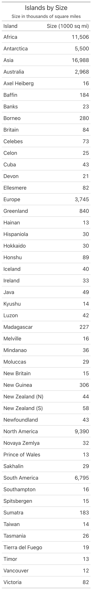
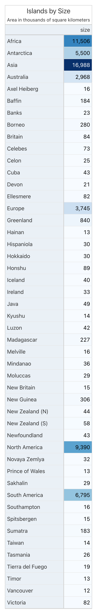

# great-tables-ci: make the flowchart's rules fail loudly instead of failing quietly

## Why a gt skill

Left to its own judgment, a model asked to turn a CSV into a styled
`great_tables` table will make a slightly different design call every time
it's asked — a different palette, a different set of colored measures, a
band it remembers to add on one run and forgets on the next. Writing the
rules down as a skill fixes some of that. But writing a rule down and
enforcing it are two different things: a skill that says "at most two
colored measures" is still just prose, and nothing stops a model from
reading it and doing something else anyway. Nothing tells you it happened
until a human looks at the rendered PNG and notices.

That's the case for this specific kind of skill: a rule a model is trusted
to remember is not the same as a rule that gets checked. If a wrong table
can still ship silently, the rule wasn't really enforced — it was a
suggestion with good intentions.

## What we do

**The goal.** Everything `great-tables` does, plus a mechanical gate that
runs *before* the table is ever rendered for real and refuses to let a rule
violation pass quietly. The design decisions are identical to the sibling
skill — this skill exists to make sure they actually landed in the output,
not to make different ones.

### What happens in the background

Most runs look almost identical to the plain flowchart's — read the
doorway, get routed to the files the data shape needs, write the table,
then run the checker instead of just eyeballing the render:

```
Skill(great-tables-ci)
Read  references/REFERENCE.md
Read  islands.csv
Read  references/data.md
Read  references/big_color/column_gradient_fill.md
Read  references/palettes.md
Read  references/scripts.md               ← the checker/helper contract
Read  references/big_color/column_label_emphasis.md
Read  references/small_color.md
Write table.py
Bash  python scripts/gt_check.py table.py  ← the gate
Bash  python table.py
Bash  ls -lh table.png
Read  table.png
```

But the checker isn't decoration — it actually catches things. Here's an
unedited excerpt from a different real run (`gtcars_hp_price`), where the
model's first draft had a bug:

```
$ python gt_check.py table.py
Exit code 1
===== gt_check: FAIL (1 issue(s)) =====
  [exec-error] table.py raised while executing:
  TypeError: opt_row_striping() got an unexpected keyword argument 'style'
  — expected: the script must run cleanly (rendering is stubbed); fix the
  runtime error — read references/small_color.md
```

The model's fix, verbatim from the transcript:

```diff
-    .opt_row_striping(style='row', color='#F6F6F6')
+    .opt_row_striping()
```

```
$ python gt_check.py table.py
===== gt_check: PASS =====
  (no issues)
```

Only after `PASS` does the model move on to actually rendering the table.
That FAIL never reached a human — it was caught and fixed inside the same
turn, before a single pixel was drawn.

### The result

Same prompt (`islands_sizes`), same "before" as its unstyled baseline —
below is what `great-tables-ci` produces once the checker above passes:

**Before** (no skill):



**After** (`great-tables-ci` loaded, checker green):



Visually this is the same product as the plain flowchart's output — that's
the point. The checker's job was never to make the table look different, it
was to make sure *this specific render* actually complied with the rules
that were supposed to produce it, instead of trusting that it did.

### How we made it good

The first cut of `gt_check.py` looked for literal `data_color(...)` /
`tab_options(...)` tokens in source — which meant a table built correctly
from the `heatmap()`/`band()` helpers, which never call those functions by
name, failed a check it should have passed. We fixed that "helper-blindness"
by teaching the checker to recognize the helper calls and read the actual
rendered DOM state for band and striping, so correctness became independent
of which path you took to get there — which is the whole point of judging
output over mechanism.

A later pass hardened the execution helpers against the inputs that actually
break math: `heatmap()` would crash or mis-color on an all-missing column,
and would render an all-zero diverging measure as the single most extreme
color in the palette instead of neutral, because a `[-0, 0]` domain is
degenerate. Both got an explicit nonzero symmetric fallback — the kind of
bug that doesn't show up until a real corpus prompt happens to have a column
that's entirely `NaN` or entirely zero, which is exactly how it was found.

We also had a real external benchmark tell us our earlier helpers were
pinning the wrong thing. As part of an early forensic study, a skill an
unrelated tool generated was run on the same prompt as a control, and it
scored higher than either of our variants at the time — its helpers pinned
domain math and palette lookup while still leaving the decision of *what* to
color to the model. That's exactly what our current helpers do now; getting
out-scored by an unaffiliated tool was the useful signal, not an
embarrassment.

And a palette-drift test parses every hex out of the human-readable palette
doc and asserts the script's `PALETTE` dict mirrors it exactly, naming the
specific divergent hex if it doesn't — so the palette can only change in one
place at a time, and drift between the doc and the code fails a test
instead of shipping quietly.

### The metrics

Here's the honest version, not the flattering one. Several of the eleven
rules `gt_check.py` enforces map directly onto a real inconsistency an early
forensic diff caught in an actual run — `too-many-measures` because a repeat
colored three measures against the two-measure ceiling; `palette-signedness`
and `domain-symmetry` because one repeat used a diverging red-green palette
on an unsigned price column, and a separate repeat used an asymmetric
domain; `frame-missing` because a repeat shipped with no enclosing border at
all. The checker exists because those specific things happened, not because
we imagined they might.

What we're not claiming: that this skill's `overall_convergence` score
reliably beats the plain flowchart's. Pulled from repeated runs of the same
prompts:

| Prompt | scripts (this skill) | prose (`great-tables`) |
|---|---|---|
| `islands_sizes` | #metric# | #metric# |
| `sp500_monthly_performance` | #metric# | #metric# |
| `towny_growth_trends` | #metric# | #metric# |
| `gtcars_top10_by_country` | #metric# | #metric# |

That's not a contradiction, it's a scope mismatch. `overall_convergence`
measures whether repeats agree with each other on a handful of shallow
fields; the checker measures whether one output complies with the fixed
rules, regardless of what any other repeat did. A checker can PASS on every
rule and the convergence score can still land lower if, say, one repeat
picked a different (but individually valid) hue for the band than another.
We'd rather print that mismatch than paper over it with a rounded-up
headline number — and it's exactly the gap the in-progress ground-truth
comparator is built to close, by scoring against one fixed correct answer
(reported as #metric# out of 100) instead of against other repeats.

We also don't yet have an aggregated report of "N rule violations caught
across the corpus" — today the evidence for the checker's value is the
individually-verified bug above, not a dashboard. That's the next thing
worth building, not something we're claiming already exists.

### Try it

```bash
cd /path/to/generated/table
python gt_check.py table.py
```

Fix what it names, re-run, repeat until `PASS`, then render for real.
`great-tables-ci` ships self-contained alongside `great-tables` and
`great-tables-house` — pick this one when you want an automated gate a
pipeline can act on, not just a set of rules a model is trusted to remember.
