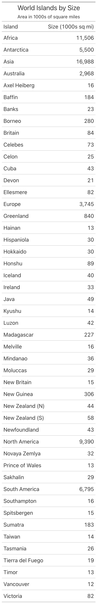
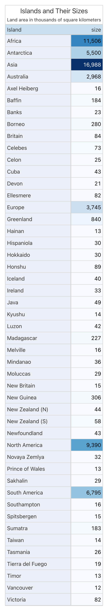

# great-tables-house: a thinner path to a table that always looks like it belongs

## Why a gt skill

Ask an AI agent to "make a table from this CSV" and you tend to get one of
two things. Without any styling guidance, you get a bare `great_tables` dump
— edge-to-edge, no color, no frame, no indication anything was designed on
purpose. With a full styling procedure bolted on, you get a heavier
multi-step flowchart the model has to walk through every single time,
whether the table is a two-column list of islands or a 70-row financial
summary. Neither is what you actually want, which is: the same input
produces the same, good-looking table, every time.

Neither failure mode is a one-off. A model's sense of "how to style this
table" is not stable run to run for identical input unless something outside
the model pins it down — and a fixed 7-step procedure, while it does pin it
down, charges the same large "read the whole procedure" tax whether the
table in front of it needed that much deliberation or not. That's the actual
argument for a skill in the first place: without one, output varies by
mood; with the wrong-weight one, every request pays for the hardest case
even when it's the easiest one.

`great-tables-house` is our answer to that for the simple/medium end of the
range. It's a third skill in the gtskill project, additive to `great-tables`
(the full flowchart) and `great-tables-ci` (the flowchart plus a mechanical
checker) — pick whichever mechanism fits: full flowchart there, enforced
checker there, one worked example here.

## What we do

**The goal.** Same outcome as the other two skills — a consistent, on-brand
table every time — for the requests that don't need a 7-step deliberation to
get there. Instead of a procedure, the model is handed one worked example
and told to pattern-match the block that fits its data's shape.

### What happens in the background

This is the entire tool-call sequence from a real run (`islands_sizes`) —
not a summary, the whole thing:

```
Skill(great-tables-house)
Read  islands.csv
Read  scripts/house_table.py               ← the one file
Read  references/RULES.md                  ← the one rule that applied
Write table.py
Bash  python table.py
Bash  ls -lh table.png
Read  table.png
```

Eight tool calls. Compare that to the fourteen-to-seventeen-call sequences
the flowchart and CI-checked skills produce for the same prompt — reading a
router file, then a data-cleaning reference, then a shape-matched color
reference, then the palette doc, then the polish checklist, then (for the
checker variant) the checker itself. Here, there's one script to read and
zero routing: no `REFERENCE.md`, no per-shape dispatch, because
`house_table.py` already contains every shape's worked block in one file.
The thinness isn't a claim about the skill's design — it's a direct
consequence of what got deleted: no numbered flowchart, no per-archetype
example directory, no checker.

### The result

**Before** (no skill):



**After** (`great-tables-house` loaded):



Title, subtitle, a boxed frame, a heading band, a heatmap on the measure
that deserves it, alternating row striping — the same category of output as
the full flowchart, produced from one file instead of a five-file chain.
Worth saying plainly: this isn't every run's outcome. In the same batch of
three repeats behind this post, one of the three skipped the mandatory title
entirely — a real gap, not a hypothetical one, and exactly the kind of
run-to-run disagreement the metrics below exist to surface rather than hide.

### How we made it good

A skill is only as good as the judgment baked into its one example, so most
of the actual engineering here isn't in the skill's word count — it's in
what informed which defaults made it in.

We didn't re-litigate color from scratch. The palette in `house_table.py`
reuses the exact hex values already validated, over months of runs, in
`great-tables-ci`'s helper module. The open design question for this skill
was never "what colors are correct" — it was "how thin can the decision
process around those colors get." Reusing a settled system let us spend the
design budget on the part that was actually new.

We built the rules from real, observed failures, not hypothetical ones. An
evidence-based audit of 154 real run transcripts from the sibling skills
surfaced four concrete defects: a pass/fail metric that only checked "did a
PNG get produced," which meant a run that silently skipped the skill
entirely scored identically to one that used it correctly; flagship
reference examples that violated their own skill's "non-negotiable" rules
(0 of 6 examples had the mandated four-side frame; stub tinting was missing
wherever a stub existed); a flagship example rendering a summary row as a
raw, unformatted float — `817860.0499999999` — because `fmt_currency` /
`fmt_integer` don't reach `grand_summary_rows()`; and an always-on stub tint
that fought row striping, producing a distracting solid vertical band down
the left side of the table. Every one of those became a rule this skill's
one example demonstrates correctly from the start.

We iterated the color hierarchy under direct design critique, not in one
shot. The first pass at the heading band used the sibling skills' rule
verbatim (light tint when Big Color is present, dark solid otherwise). On
review, that produced tables that read as "mostly grey chrome with one
colored heatmap," not "one themed product." The current version replaces
that with a deliberate three-tier hue-strength hierarchy applied
consistently across every structural surface: a solid accent band, a
visibly tinted stub and group header, and a barely-there washed row stripe —
all pinned to the same one hue, so the whole table reads as a single theme
instead of neutral furniture plus an unrelated colored measure.

We caught real correctness bugs before they shipped, via multiple rounds of
automated review on the PR, triaged rather than rubber-stamped. Real bugs
fixed: a missing parameter that raised a `TypeError` exactly when the rules
file told callers to pass it; a domain calculation that crashed on an
all-missing column; a status-chip row-matching bug that could silently
paint the wrong row's color when row labels repeated across groups; a
summary row whose value cells were bolded but whose label cell in the stub
wasn't. Lower-value cosmetic nits from the same reviews were explicitly
declined rather than chased — the goal is fixing what's real, not
maximizing the number of review comments closed.

We also found and fixed an invocation gap by actually running the corpus.
Running all six corpus prompts under `--skill house` surfaced something the
design review alone couldn't: on 4 of 6 prompts, the model never called the
skill at all and shipped a bare, unstyled table — it only reached for the
skill on requests that "felt" like they needed table design help. The fix
was a one-line addition to the skill's trigger description, and re-testing
confirmed all four previously-skipped prompts now invoke the skill before
touching the data.

### The metrics

The methodology behind all of this is deliberately anti-subjective. An
LLM-as-judge scorer for table quality was specced early in the project and
then killed — walking every quality dimension it would have scored showed
almost all of it is mechanically checkable, and an LLM judge would have
reintroduced, inside the evaluation, the exact same run-to-run inconsistency
the skill exists to eliminate. So the locked rule for this project is: no
LLM anywhere in the scoring path, ever — every check is a deterministic
comparison against an authored ground truth.

Two things back that up today. First, convergence scoring: the harness runs
the same prompt N times under a given skill and scores field-by-field
agreement across the repeats — palette, frame presence, band hue, striping,
stub, grouping, and more — into one `overall_convergence` number. Here's
the actual per-prompt result across the corpus:

| Prompt | `overall_convergence` |
|---|---|
| `islands_sizes` | #metric# |
| `gtcars_top10_by_country` | #metric# |
| `gtcars_hp_price` | #metric# |
| `airquality_monthly_summary` | #metric# |
| `sp500_monthly_performance` | #metric# |
| `towny_growth_trends` | #metric# |

That's a real spread, not a rounded-up headline number — the simplest, most
structurally regular prompt converges tightest, and the prompts with more
open judgment calls (a monthly financial summary, a multi-metric growth
ranking) converge loosest. The dropped-title repeat mentioned above is
exactly the kind of disagreement this number is built to catch — that's the
honest shape of what one worked example can pin down versus what still
depends on the model's read of an underspecified request.

Second, an audit trail that caught its own blind spot. The pass-rate finding
above — a 100% pass rate on a run that never invoked the skill — is the
reason the metric that matters isn't just "did a PNG render," it's
activation-aware: did the skill actually get used, and does the resulting
script pass the rubric of mandatory design elements. That distinction is
what let us find and close the four-of-six invocation gap described above
instead of it hiding behind a green checkmark.

The next milestone, already in progress, closes the loop further: a
deterministic ground-truth comparator that scores any generated table
against a hand-authored "known correct answer" for that prompt — reported as
#metric# out of 100, split into a Data-compliance score of #metric# and a
Formatting-compliance score of #metric#, roughly 25 independent checks, each
reporting exactly what passed, what failed, and how many points it was
worth. Row selection, computed values, which measure got colored, whether
the domain is symmetric or data-driven, whether a summary row's formatting
matches its body — all diffed against an answer key a human wrote once,
none of it interpreted by a model at scoring time. One ground truth exists
today; the rest of the corpus and the comparator script itself are the next
work, and until they land, `overall_convergence` — which measures agreement
between repeats, not correctness against a known answer — is the best
evidence we have. Once the comparator lands, every future change to
`great-tables-house` gets checked against a known-correct answer
automatically, not just measured for self-consistency.

### Try it

```bash
python run.py --skill house --prompt sp500_monthly_performance
python run.py --skill house --difficulty all --repeat 5   # convergence across the full corpus
```

Or, in a project with the skill installed, just ask Claude to build a table
from a CSV — the skill's trigger description is written to fire even on
requests that look simple, because those are exactly the ones a bare,
unstyled table used to slip through on.
