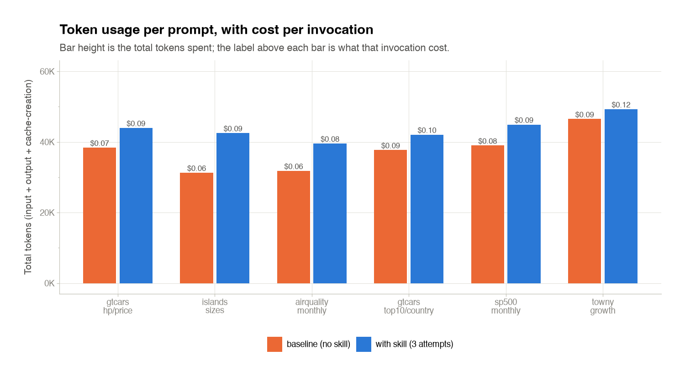
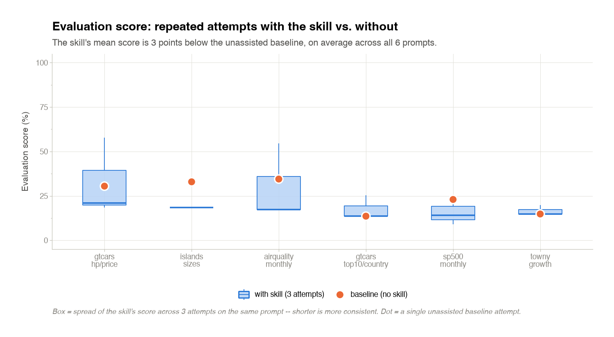
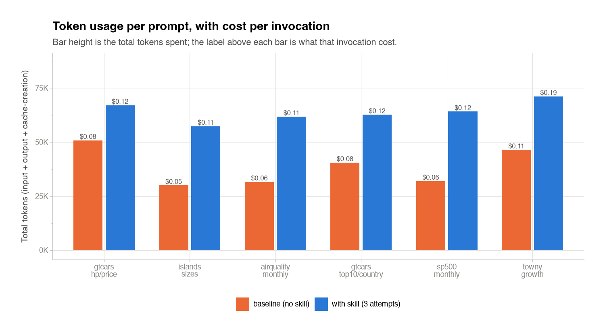
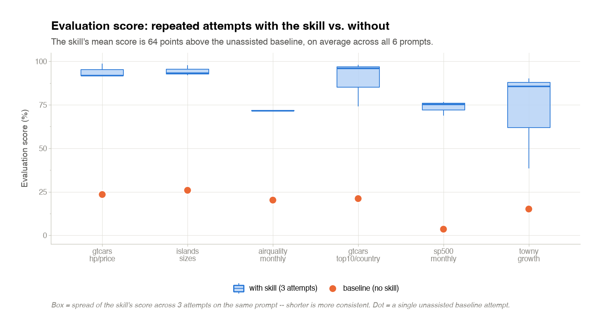
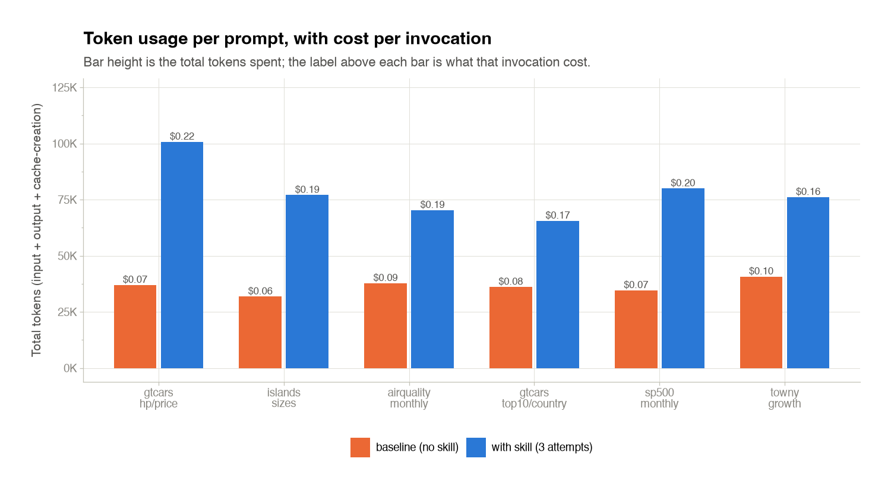
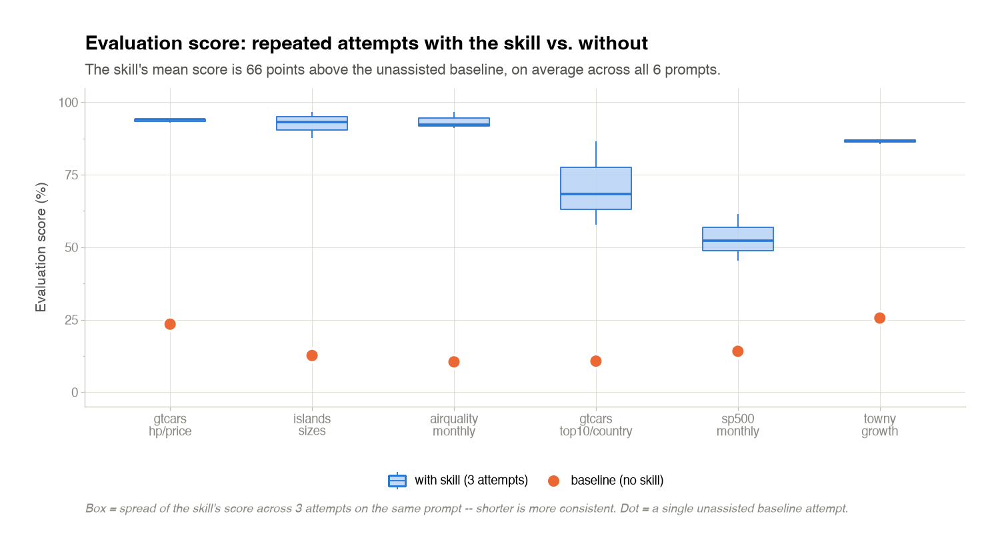
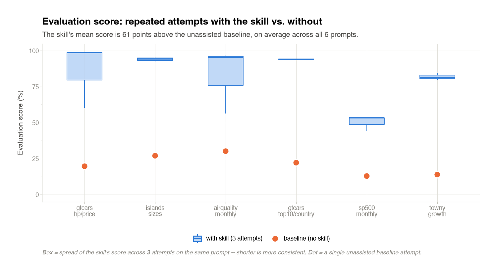

# gtskill

A tiny, lightweight harness that uses the [Claude Agent SDK](https://pypi.org/project/claude-agent-sdk/) plus a one-paragraph [Great Tables](https://posit-dev.github.io/great-tables/) skill to turn a CSV + a natural-language prompt into a formatted table.

## Setup

```bash
python -m venv .venv
source .venv/bin/activate
pip install claude-agent-sdk great_tables pandas python-dotenv anyio pillow
# for the ground-truth judge (runner/judge.py):
pip install anthropic
# for the web UI backend:
pip install starlette uvicorn sse-starlette websockets
# for regenerating the eval-results/ plots (metrics_plots package):
pip install plotnine
# also need the Claude Code CLI on PATH:
npm install -g @anthropic-ai/claude-code
```

Create a `.env` with your key:

```
ANTHROPIC_API_KEY=sk-ant-...
# Optional (usually chosen with --model instead): a concrete model id override
GTSKILL_AGENT_MODEL=claude-haiku-4-5
```

## Usage

One flag-driven runner drives every flow (the web app calls the same core):

```bash
# one corpus prompt under the prose skill
python run.py --skill prose --prompt sp500_monthly_performance

# convergence: scripts skill, 3 repeats (baseline auto-on), Haiku
python run.py --skill scripts --prompt sp500_monthly_performance --repeat 3

# sweep every easy prompt under the creator skill
python run.py --skill creator --difficulty easy

# random per-difficulty sample: 2 easy + 2 medium + 2 hard (6 prompts total)
python run.py --skill prose --random 2

# an ad-hoc prompt against a chosen data file
python run.py --skill prose --prompt-text "Top 10 cars by MSRP" --data data/gtcars.csv

# full evaluation: same random sample across all 4 skills, populates eval-results/
# (see the "Skill evaluation" section below — check the cost table first)
python run.py --evaluate --random 2 --repeat 3
```

Flags: `--skill {prose,scripts,creator,house}`; `--prompt NAME` (repeatable) /
`--difficulty {easy,medium,hard,all}` / `--random N` (N prompts per difficulty,
unseeded) / `--prompt-text TEXT --data PATH`; `--repeat N`;
`--model {haiku,sonnet,opus}`; `--baseline` / `--no-baseline` (default auto —
the no-skill control runs iff `--repeat > 1`); `--evaluate` (see below).

Each run writes one tree under `runs/<ts>_<skill>_<slug>/`:

- `run.json` — the RunSpec + resolved config + status + timings
- `summary.json` — aggregate pass/fail + tokens/cost across all prompts
- `prompts/<name>/{baseline,repeat_1…N}/` — each with `table.py`, `table.png`,
  `transcript.json`, the data snapshot, and the mounted `.claude/`
- `prompts/<name>/{convergence.json,contact_sheet.png}` — only when `--repeat > 1`

The CSV stays where it is — the agent reads it from a symlink in the run dir and
is **never** asked to copy it elsewhere.

## Skill evaluation

`--evaluate` runs the same prompt set across all four skills, populates a
runtime `eval-results/` tree, and regenerates plots via the `metrics_plots`
package. Everything else about the runner is unchanged — this is opt-in.

```bash
# smallest sanction: 2 prompts per difficulty, 3 repeats, all 4 skills
python run.py --evaluate --random 2 --repeat 3

# maxed-out evaluation: 5 per difficulty, 5 repeats
python run.py --evaluate --random 5 --repeat 5

# explicit prompt selection also works — must cover all three difficulties
# with 2-5 prompts each
python run.py --evaluate --difficulty all --repeat 3
```

Constraints (validated before any API spend — the run aborts if any fail):

- `--skill` must be **omitted** (`--evaluate` always runs all 4 skills).
- `--repeat` must be `>= 3` (bare-minimum consistency signal).
- Prompt selection: `--random N` with `2 <= N <= 5`, **or** an explicit
  `--prompt` / `--difficulty` combination yielding 2–5 prompts per difficulty
  across easy/medium/hard.
- `--prompt-text` / `--data` (ad-hoc prompts) are not allowed — evaluation
  needs corpus prompts because ground truth is what the score is measured
  against.

### ⚠️ Cost warning

Every `--evaluate` run is **4 skills × prompts-per-difficulty × 3 difficulties
× (repeats + 1 baseline)** API invocations. That scales fast. The table below
uses the observed mean per-invocation cost (~$0.13 with-skill, ~$0.08
baseline) from an actual 96-invocation snapshot on `haiku` — swap in `sonnet`
or `opus` via `--model` and the per-invocation cost climbs roughly with the
model's own token price.

| prompts / difficulty | `--repeat` | total invocations | est. cost (haiku) |
| ---: | ---: | ---: | ---: |
| 2 | 3 | 96 | **~$12** |
| 2 | 5 | 144 | **~$18** |
| 3 | 3 | 144 | **~$17** |
| 3 | 5 | 216 | **~$26** |
| 5 | 3 | 240 | **~$28** |
| 5 | 5 | 360 | **~$44** |

Formula: `invocations = 4 × prompts_per_difficulty × 3 × (repeat + 1)`, and
`cost ≈ 4 × prompts_per_difficulty × 3 × (repeat × $0.13 + $0.08)`.

If you are running this to demo the skill, prefer the low-left corner of the
table. `--random 2 --repeat 3` is enough to see the shape of every plot.

### What ends up in `eval-results/`

`--evaluate` first wipes `eval-results/`, then for each skill copies its
per-prompt outputs (`table.py`, `table.png`, `transcript.json` per variant)
into `eval-results/<skill>/samples/<prompt>/`. Once all four skills finish,
`metrics_plots.render_all` writes `eval-results/<skill>/metrics.json` and
`eval-results/<skill>/plots/*.png` for each skill.

Plot layout is adaptive: when every difficulty has ≤3 prompts, the plots
condense into one `usage.png` + `evaluation_score.png` pair per skill. When
any difficulty exceeds 3 (e.g. `--random 4` or `--random 5`), each skill's
plots split into one pair **per difficulty**
(`usage_easy.png` / `usage_medium.png` / `usage_hard.png`, likewise for
`evaluation_score`).

`eval-results/` is gitignored — a fresh `--evaluate` overwrites it every time,
and the intent is that it's a runtime output, not something checked in.

### `published-metrics/` (checked in, static — ~550 KB)

A `--evaluate` run also refreshes `published-metrics/` — a lightweight
snapshot that ships with the repo. It contains only the two deterministic
plot PNGs per skill and the overall ranking `SUMMARY.md`, no per-sample
`table.py` / `table.png` / `transcript.json`. The heavy per-sample
artifacts stay under the gitignored runtime `eval-results/`.

```
published-metrics/
  SUMMARY.md                            # per-skill ranking: table + at-a-glance + leaders
  creator/{usage,evaluation_score}.png
  house/{usage,evaluation_score}.png
  prose/{usage,evaluation_score}.png
  scripts/{usage,evaluation_score}.png
```

See [`published-metrics/SUMMARY.md`](published-metrics/SUMMARY.md) for the
last committed comparison of all four skills.

#### Latest committed results

**`creator`** — the great-tables skill-authoring aid

| Usage & cost per invocation | Evaluation score across attempts |
| :---: | :---: |
|  |  |

**`house`** — the house style skill

| Usage & cost per invocation | Evaluation score across attempts |
| :---: | :---: |
|  |  |

**`prose`** — the prose great-tables skill

| Usage & cost per invocation | Evaluation score across attempts |
| :---: | :---: |
|  |  |

**`scripts`** — the great-tables-ci scripted skill

| Usage & cost per invocation | Evaluation score across attempts |
| :---: | :---: |
|  |  |

#### Refreshing published-metrics

To refresh from your own run, either run
`python run.py --evaluate --random 2 --repeat 3` (which auto-publishes)
or, from a runtime `eval-results/` tree that already exists, call the
publish API directly:

```python
from pathlib import Path
from metrics_plots import publish
publish(Path("eval-results"), Path("published-metrics"))
```

## Web UI

The same runner is also available through a browser-based control plane:

```bash
uvicorn web.server:app --port 8000
```

Then open `http://localhost:8000`. It calls the same `runner` core as `run.py`,
so a run launched from the browser behaves identically to one launched from
the CLI.

## How it works

- Three self-contained skills live under `.claude/skills/great-tables` (prose),
  `.claude/skills/great-tables-ci` (scripts), and `.claude-skill-creator`
  (creator); the runner mounts exactly one per run into an ephemeral `.claude/`.
- `runner/engine.py` calls `claude_agent_sdk.query` with the one mounted skill
  plus `Read`, `Write`, `Edit`, `Bash`, `Glob`, `Grep`. The agent loads the
  skill, reads the data, writes `table.py`, runs it, and the script renders
  `table.png` via `gt.gtsave("table.png")` (attached to a sidecar Chrome over CDP).
