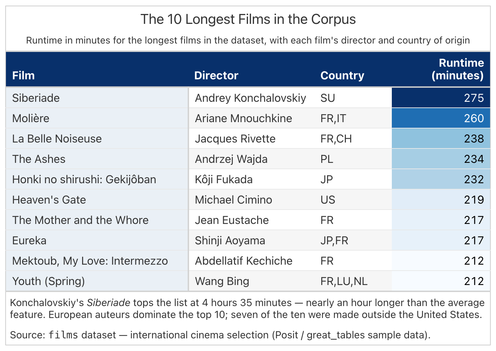

# gtskill

> **Can an AI agent write publication-quality data tables — reliably, cheaply, and repeatably?**
> `gtskill` is the harness we built to answer that. It pairs the
> [Claude Agent SDK](https://pypi.org/project/claude-agent-sdk/) with a hand-tuned
> [Great Tables](https://posit-dev.github.io/great-tables/) *skill*, then measures
> — with a real evaluation loop — how much the skill actually helps.

📖 **Docs:** <https://hrudithl.github.io/gt-skill/> · 📊 **[Results](published-metrics/SUMMARY.md)** · 🧪 **[Reproduce](docs/reproduce.qmd)**

---

## The headline result

We evaluated four different "skill" designs against a **no-skill baseline** on the same
6-prompt corpus, with 3 repeats per prompt. The winner:

| Skill | Accuracy (with skill) | Accuracy (no skill) | Lift | Cost / call |
| :--- | ---: | ---: | ---: | ---: |
| **`prose`**   | **87.9%** | 15.8% | **+72.1** | $0.16 |
| `scripts` | 87.7% | 19.0% | +68.7 | $0.19 |
| `house`   | 83.5% | 20.1% | +63.4 | $0.13 |
| `creator` | 21.7% | 24.9% | −3.2  | $0.09 |

The prose skill takes a bare-LLM baseline from **16% accuracy to 88%** — a **72-point lift**
on the same prompts, the same model, the same data. For a fraction of a cent per invocation.


*Every prompt: three with-skill samples (blue boxes) vs. the unassisted baseline (orange dot).*

---

## What it produces

Give the harness a CSV and a natural-language prompt. It renders a table like this:

<p align="center">
  
</p>

That's a real ground-truth reference from the corpus. The agent produces the `table.py`
that renders it, plus a full transcript of how it got there.

---

## Why this exists

If you have ever tried to get a general-purpose LLM to output a *nice* formatted table,
you already know the failure modes: unstyled dumps, invented columns, hallucinated data,
inconsistent number formatting, no headers, and — worst of all — outputs that look
different every time you ask.

`gtskill` answers three questions that matter to anyone shipping AI-assisted data work:

1. **Does a well-authored "skill" actually make the model reliable?**
   Yes — the [prose skill](docs/skills.qmd) closes 72 accuracy points of gap vs. the
   unassisted model, and produces the *same* design choices across repeats (measured
   by a dedicated [convergence report](docs/methodology.qmd)).
2. **What is the marginal cost of that reliability?**
   Roughly **8 cents extra per invocation** at Haiku prices. That is fully measured —
   the harness reads `total_cost_usd` straight from the SDK, not derived from token counts.
3. **How do you engineer such a skill without hand-waving?**
   By running a corpus, measuring, and only keeping rules that move the score. Every
   line of `SKILL.md` traces to a failing test case. See
   [Methodology](docs/methodology.qmd).

---

## What's in the repo

```
gtskill/
├── .claude/skills/           # 4 skill variants — the artifacts under test
│   ├── great-tables/               # "prose"    — flowchart + reference tree
│   ├── great-tables-ci/            # "scripts"  — flowchart + a self-check loop
│   ├── great-tables-house/         # "house"    — one worked script + short rules
│   └── great-tables-creator/       # "creator"  — candidate A/B skill design
│
├── runner/                   # The harness itself — one entry point, one RunSpec
│   ├── engine.py                   # the only file that touches the Agent SDK
│   ├── orchestrate.py              # per-run dir, sidecar Chrome, per-prompt loop
│   ├── comparator.py               # 0–108 mechanical + judge-backed scoring
│   ├── judge.py                    # grounded vision-model rubric
│   └── convergence.py              # cross-sample agreement fraction
│
├── prompts/{easy,medium,hard}/   # 24 corpus prompts + ground-truth PNGs
├── data/                     # CSVs (materialized via scripts/fetch_data.py)
├── metrics_plots/            # Plot renderer + SUMMARY.md generator
├── published-metrics/        # Committed evaluation snapshot (plots + SUMMARY)
├── docs/                     # Quarto site — deep dives on every layer
└── run.py                    # single CLI entry point
```

**One entry point.** Every flow — a single prompt, a convergence study, a full sweep,
an ad-hoc prompt against your own CSV, or the whole 4-skill evaluation — is one
`run.py` invocation with different flags. See [Runner CLI reference](docs/runner.qmd).

---

## Quick start

```bash
git clone https://github.com/HrudithL/gt-skill && cd gt-skill
python -m venv .venv && source .venv/bin/activate
pip install claude-agent-sdk great_tables pandas python-dotenv anyio pillow anthropic plotnine
npm install -g @anthropic-ai/claude-code
echo 'ANTHROPIC_API_KEY=sk-ant-...' > .env

python scripts/fetch_data.py               # provision data/*.csv
python run.py --skill prose \
              --prompt-text "Top 10 cars by MSRP with country of origin" \
              --data data/gtcars.csv
```

That prints one path — the run directory — and produces one `table.png` under it.
Open it. That is what the skill built.

Want to see how much the skill helps? Add `--repeat 3`. The auto-baseline turns on,
and you get a lift-adjusted score for that prompt:

```bash
python run.py --skill prose --prompt sp500_monthly_performance --repeat 3
```

Full setup, flag reference, and reproduction guide are on the [docs site](https://hrudithl.github.io/gt-skill/).

---

## How it works

```
        ┌──────────────────────────────────────────────────────────────┐
        │  RunSpec  (skill, prompts, repeats, model, baseline)         │
        └──────────────────────────────────────────────────────────────┘
                                    │
                                    ▼
   ┌────────────────────────────────────────────────────────────────────────┐
   │  orchestrate.run_spec()                                                │
   │  • builds one run dir on disk                                          │
   │  • launches one headless sidecar Chrome (for gt.gtsave)                │
   │  • loops over prompts × (repeats + baseline)                           │
   └────────────────────────────────────────────────────────────────────────┘
                                    │
                                    ▼
   ┌────────────────────────────────────────────────────────────────────────┐
   │  engine.run()  — for each invocation                                   │
   │  1. rebuild an ephemeral .claude/ with exactly one skill mounted       │
   │  2. call claude_agent_sdk.query(prompt, tools=[Read,Write,Bash,...])   │
   │  3. agent writes table.py, runs it → table.png via sidecar Chrome      │
   │  4. capture transcript.json + tokens + cost                            │
   └────────────────────────────────────────────────────────────────────────┘
                                    │
                                    ▼
   ┌────────────────────────────────────────────────────────────────────────┐
   │  comparator + judge  →  0–108 point score  →  metrics.json + plots     │
   └────────────────────────────────────────────────────────────────────────┘
```

Key design choices — each documented in the [Harness chapter](docs/harness.qmd):

- **One skill per run.** `.claude/` is rebuilt with `rmtree + recreate` on every
  invocation. Previous skills, previous variants, and stale baselines cannot leak.
- **Baseline is the same model, no skill.** `variant="none"` mounts nothing at all.
  That is the honest reference for "how far does a bare LLM get?"
- **The judge is a different model** than the writer. The writer is on Haiku by default;
  the judge is Sonnet with vision. It only reads two PNGs (candidate + ground truth) and
  never sees the writer's transcript.
- **The rendered PNG uses one sidecar Chrome per run.** `gt.gtsave()` attaches over CDP
  via a `.pth` hook — Claude Code's sandbox otherwise blocks Chrome startup on macOS.

---

## How the skill was engineered

The current `great-tables` skill was **earned from observed failure**, not authored
top-down. Every rule in `SKILL.md` — and every file it points at under `references/` —
has a specific test case attached: a prompt the model got wrong without the rule, and
right with it. Rules that didn't discriminate were cut.

The loop, in pseudocode:

```python
while iterations < budget:
    run(corpus, current_skill)                    # 6 prompts × 3 samples
    scores      = comparator.score(outputs)       # 0–108 per table
    convergence = measure_agreement(samples)      # cross-sample agreement
    for failure in inspect(low_scores):
        proposal = phrase_as_rule(failure)        # one-line addition to SKILL.md
        if raises(scores) and non_regressive(convergence):
            keep(proposal)
        else:
            discard(proposal)
    iterations += 1
```

The four skill variants (`prose`, `scripts`, `house`, `creator`) are the artifacts of
exploring different points in this design space — a menu-vs-flowchart axis, a
self-check-yes-vs-no axis, a reference-tree-size axis. The methodology page shows the
data behind every one. See [Methodology](docs/methodology.qmd).

---

## Full results at a glance

Every skill on every prompt. The two plots per skill:

| Skill | Accuracy | Cost per call |
| :--- | :---: | :---: |
| **prose** — the mature flowchart skill |  |  |
| **scripts** — flowchart + self-check   |  |  |
| **house** — minimal one-worked-script  |    |    |
| **creator** — candidate A/B design     |  |  |

Deep dive per prompt and per run: the [Results page](https://hrudithl.github.io/gt-skill/results.html)
on the docs site has every individual score, every baseline, and per-prompt lift.

Regenerate any of this locally with one command:

```bash
python run.py --evaluate --random 2 --repeat 3
```

That runs the same 6-prompt sample under all four skills, populates the runtime
`eval-results/` tree, and refreshes the committed `published-metrics/` snapshot.
Read the cost warning below first.

---

## ⚠️ Cost warning

`--evaluate` scales fast: **4 skills × prompts-per-difficulty × 3 difficulties × (repeats + 1 baseline)** API calls.
Observed mean per-invocation cost on Haiku is ~$0.13 with-skill and ~$0.08 baseline.

| prompts / difficulty | `--repeat` | total invocations | est. cost (haiku) |
| ---: | ---: | ---: | ---: |
| 2 | 3 | 96  | **~$12** |
| 2 | 5 | 144 | **~$18** |
| 3 | 3 | 144 | **~$17** |
| 3 | 5 | 216 | **~$26** |
| 5 | 3 | 240 | **~$28** |
| 5 | 5 | 360 | **~$44** |

Prefer `--random 2 --repeat 3` for a demo — enough to see the shape of every plot.
Formula: `invocations = 4 × prompts_per_difficulty × 3 × (repeat + 1)`;
`cost ≈ 4 × prompts_per_difficulty × 3 × (repeat × $0.13 + $0.08)`.

---

## Where to go next

- **[Docs site](https://hrudithl.github.io/gt-skill/)** — the complete narrative, one chapter per layer.
- **[Setup](docs/setup.qmd)** — clone → running in 5 minutes.
- **[Skills](docs/skills.qmd)** — what each of the four variants does, and when to pick which.
- **[Runner CLI](docs/runner.qmd)** — every flag on `run.py`.
- **[Harness](docs/harness.qmd)** — architecture, sandboxing, sidecar Chrome.
- **[Methodology](docs/methodology.qmd)** — the comparator, the judge, the convergence loop.
- **[Results](docs/results.qmd)** — the current committed evaluation, per skill and per prompt.
- **[Reproduce](docs/reproduce.qmd)** — repeat the numbers on this page yourself.
- **[CONTRIBUTING.md](CONTRIBUTING.md)** — the branch-tree / review-loop playbook this repo runs on.

## License

See [LICENSE](LICENSE).
