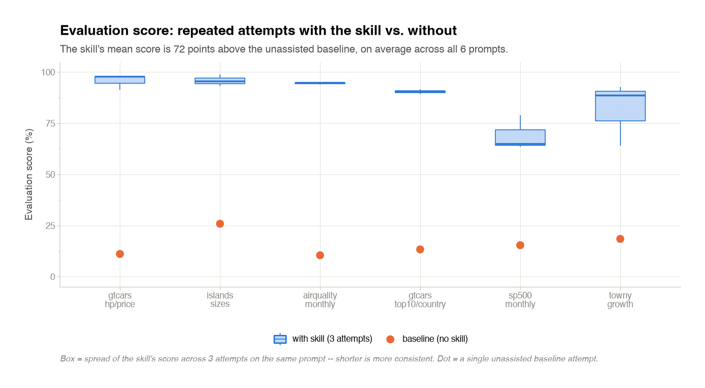
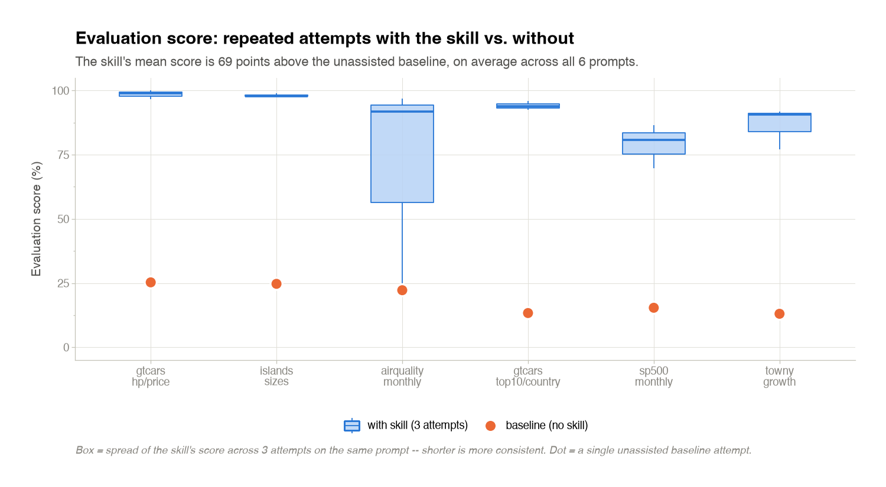
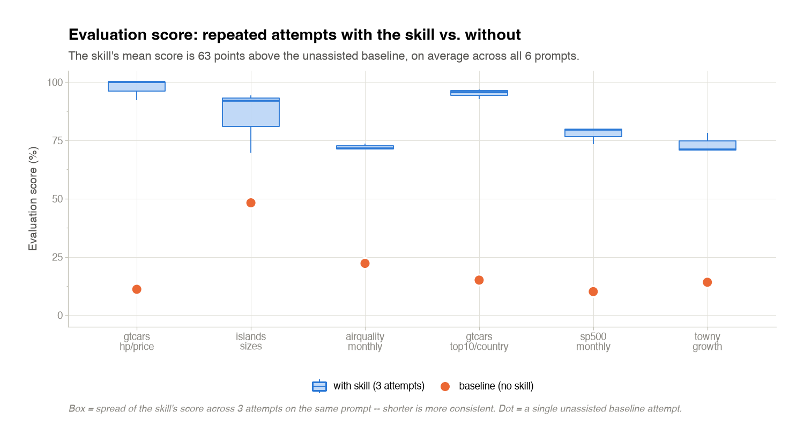
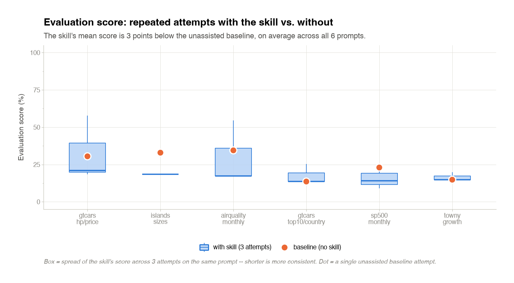

This chapter is the "how we got here" for the skill. It describes the
loop that produced the current `SKILL.md` files: what feedback we
collected, what scored the tables, how convergence was measured, and
which decisions ended up in the skill vs. discarded.

## How the skill was engineered

The `great-tables` skill was **earned from observed failure**, not
authored top-down. Every line in `SKILL.md` — and every file it points
at under `references/` — has a specific test case attached to it: a
prompt the model got wrong without the rule, and got right with it.
When a rule was tried and *didn't* discriminate between good and bad
outputs across the corpus, it was cut.

The loop:

1. Run the corpus under the current skill.
2. Score every output with the [comparator](#the-comparator).
3. Look at the failures. Ask: is this a rule the skill could have
   given the model? If yes, phrase it as a one-line addition to
   `SKILL.md` or a routed reference file.
4. Re-run the same corpus with the amended skill.
5. Keep the change iff its effect on the score is positive **and**
   its effect on convergence is non-negative (see below). Discard
   otherwise.
6. Iterate.

The four skill variants (`prose`, `scripts`, `house`, `creator`) are
the artifacts of exploring different points in this design space — a
menu-vs-flowchart axis, a self-check-yes-vs-no axis, a
reference-tree-size axis.

## The evaluation loop

For every prompt in the corpus, one **evaluation run** produces:

- The agent's `table.py` and its rendered `table.png`.
- A `transcript.json` of the whole SDK conversation.
- Optionally: a `report.txt` from the comparator, scoring the
  candidate against the prompt's ground truth.

For every skill variant, an **evaluation sweep** repeats that across
every corpus prompt, with `--repeat 3` and an auto-baseline. That
produces:

- Three per-prompt samples per variant, plus one baseline per prompt.
- One aggregate `summary.json` per sweep — pass/fail rates, tokens,
  cost.
- Per-skill plots (`comparator_score.png`, `usage.png`) that compare
  the three-sample distribution to the baseline for every prompt.

The plots are what the `attempts → samples` rename in
[this fix](https://github.com/HrudithL/gt-skill/pull/127) reframed:
each sample is one full agent invocation, not one of several tries at
the same question.

### Results at a glance

The four skills side by side on the same corpus, from a full sweep at
`--repeat 3` with the auto-baseline. The **box** is the spread of the
skill's evaluation score across the three samples on that prompt; the
**dot** is the unassisted baseline for the same prompt.

::: {.panel-tabset}

## Prose

{fig-alt="Evaluation score box plot for the prose skill on every corpus prompt, showing three samples per prompt and a baseline dot."}

Token usage and per-invocation cost for the same run:

{fig-alt="Grouped bar chart of mean total tokens per prompt for the prose skill vs. baseline, with USD cost labeled at each bar's tip."}

## Scripts

{fig-alt="Evaluation score box plot for the scripted skill."}

{fig-alt="Token / cost bar chart for the scripted skill."}

## House

{fig-alt="Evaluation score box plot for the house skill."}

{fig-alt="Token / cost bar chart for the house skill."}

## Creator

{fig-alt="Evaluation score box plot for the creator candidate skill."}

{fig-alt="Token / cost bar chart for the creator candidate skill."}

:::

::: {.callout-note}
## Historical wording in these renders
The frozen PNGs above were rendered before the `attempts → samples`
rename landed. The `_plots.py` in git says "samples"; a re-render off
the current code will use the new caption. Same data, different
labels.
:::

## The judge

`runner.judge` runs a **grounded LLM judge** for the dimensions the
comparator can't score with regex or AST parsing — title clarity,
column-label wording, column ordering. It is one vision-capable call
that reads two rendered PNGs (candidate + ground truth) and returns
structured output for four keys.

Key design points:

- **The judge is not the agent.** It runs on a separate model
  (`sonnet` by default, overridable via `GTSKILL_JUDGE_MODEL`) and
  never sees the writer's `transcript.json`.
- **The judge never renders.** It only reads bytes from two
  already-existing PNGs. If either is missing, the judge returns
  "unavailable" and every judge-backed check degrades to `0/0`
  (excluded from the denominator, not counted as a failure).
- **The judge is called at most once per comparison,** batched over
  all judge-backed keys. This caps cost and prevents check-level drift
  across dimensions.

Three of the original seven judge-scored dimensions
(caption-quality, subtitle-quality, color-theme-quality) were retired
after field data showed they didn't discriminate skill quality — a
reminder that a dimension being *judgeable* doesn't make it worth
scoring.

## The comparator

`runner.comparator` produces a **0–108 point score** per table:
Data-compliance (0–53) + Formatting-compliance (0–55). About 25 checks
contribute, split into two tiers:

- **Mechanical checks** (Tier 1 + Tier 2) — regex/AST parsing of
  `table.py`, plus execution + value comparison against the ground
  truth. One provably-correct answer per check; fully deterministic.
- **Judge-backed checks** — call `runner.judge` once and read
  individual keys out of the single combined result.

Every check function has the same signature. Every judge-backed check
degrades to `0/0` (via the `_na()` pattern) if the judge is unavailable
or the dimension doesn't apply to this comparison — **nothing ever
silently passes or fails**. `CheckResult.tier` records whether a check
was mechanical or judge-backed, so the printed report makes the
distinction visible.

The 6 ground truths were rewritten in one pass to pin down formerly
discretionary decisions as flat house rules: a deep-navy header/stub
brand regardless of a table's heatmap hue, row striping by default,
hero-uncolored measures never bold, `force_sign` on signed percent
measures, and short captions. That change added +16 points of
Formatting-compliance headroom to the scoring surface.

## Convergence

For a prompt run with `--repeat N > 1`, the harness computes a
**convergence report**: how often the N samples land on the same design
choices. `runner.convergence` parses each sample's `table.py` for a
fixed set of `CONVERGENCE_FIELDS` (palette, grouping, stub column,
visible columns, number formatting, `data_color` domains, plus a
best-effort hash of the rendered frame) and reports the agreement
fraction, averaged over fields.

A skill that scores high on the comparator but has low convergence is
producing lucky one-shot tables. Convergence catches that: a change to
the skill that *raises the mean score* but *lowers convergence* is a
change that added noise, not signal. Rules were only kept if
convergence stayed flat or rose.

The contact-sheet PNG (`contact_sheet.png`) composites the N samples
side by side so a human can eyeball whether they actually look
similar — a check on the convergence parser itself.

## What "publishing standards" mean here

- **Every rule in the skill traces to a failing test case.** No
  preemptive rules for behavior the model already handles.
- **Every scored dimension traces to a discriminating one.** Retire
  dimensions that don't move the needle.
- **Every evaluation output is reproducible from a single command.**
  See the [reproduce chapter](reproduce.qmd).
- **Every change to the skill is diffed against a comparator + a
  convergence report.** Silent regressions are hard to introduce.
