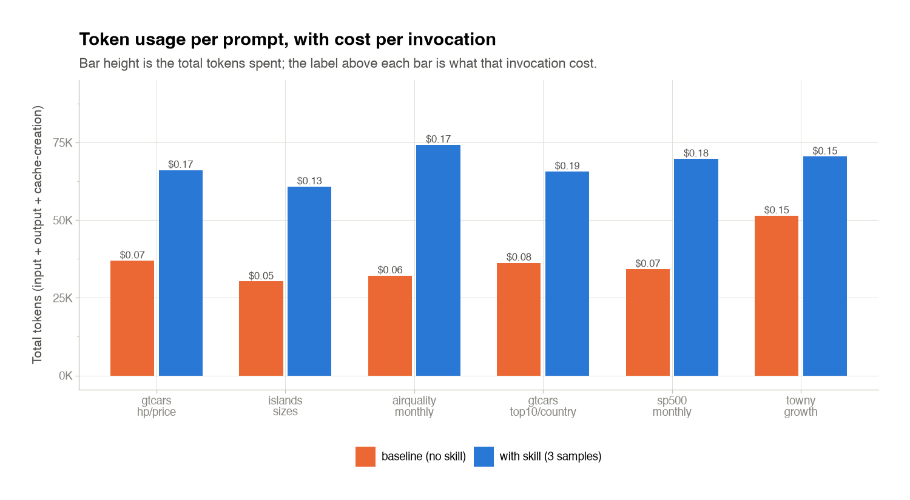
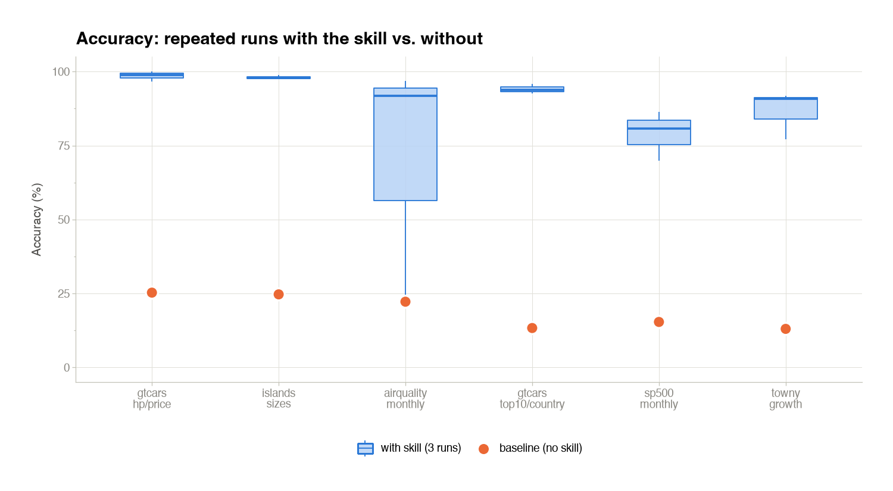
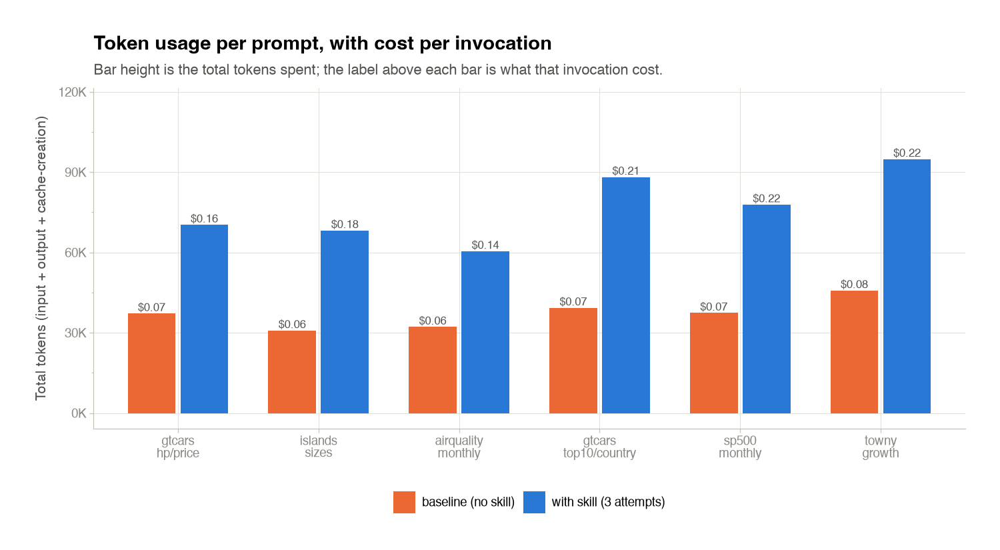
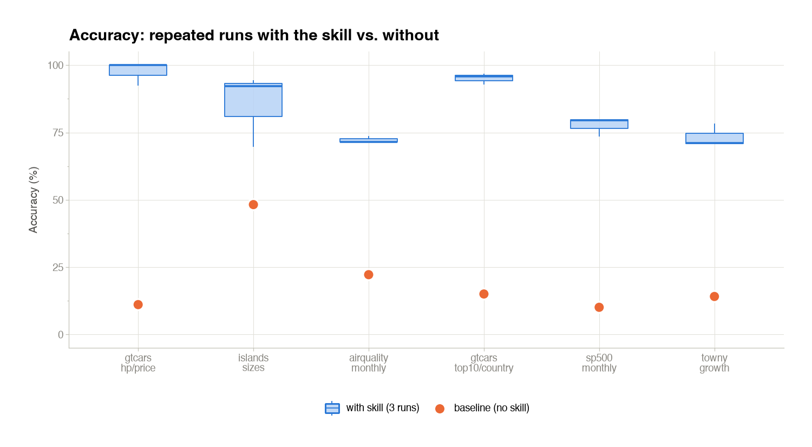
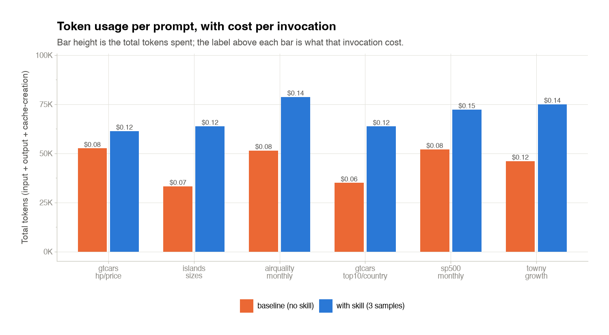
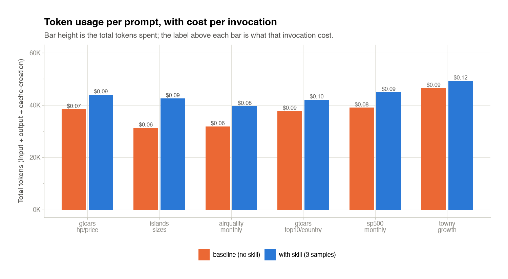

This page reports the current committed evaluation of the four `gtskill`
skill variants — [creator](skills.qmd#creator), [house](skills.qmd#house),
[prose](skills.qmd#prose), and [scripts](skills.qmd#scripts) — on the same
6-prompt evaluation corpus, at `--repeat 3` with the auto-baseline.

Every number below comes from `metrics.json` files scored by
[`runner.comparator`](methodology.qmd#the-comparator) plus the grounded
LLM [judge](methodology.qmd#the-judge). Nothing was hand-tuned.

## Why these numbers matter

A skilled table takes an LLM from an unusable **~18% accuracy** on the
corpus to a **near-publication-quality 87%+**. That is the difference
between "I'll fix this by hand" and "this is ready to ship."

For anyone shipping AI-assisted data work, that shift has three
practical consequences:

- **You can trust the output enough to skim, not audit.** Every
  formatting decision — palette, band, striping, formatter — is pinned
  by the skill, so review time is measured in seconds per table, not
  minutes.
- **The output is repeatable.** The [convergence report](methodology.qmd#convergence)
  measures how often independent samples land on the same design
  choices. High convergence + high accuracy is what makes a skill
  production-viable; the two mature skills score well on both.
- **The cost is fully quantified.** Every skill's per-invocation cost
  is read straight from Claude's `total_cost_usd`. No token accounting,
  no derivations. The prose skill costs roughly **8 cents extra per
  invocation** on Haiku for +72 accuracy points — a well-defined
  tradeoff you can budget against.

## Overall ranking

Averaged across every prompt and every run in this evaluation.

| Skill | Accuracy (with skill) | Accuracy (baseline) | Lift | Cost / invocation (with skill) | Cost / invocation (baseline) |
| --- | ---: | ---: | ---: | ---: | ---: |
| `creator` | 21.7% | 24.9% | −3.2 | \$0.0946 | \$0.0726 |
| `house` | 83.5% | 20.1% | +63.4 | \$0.1330 | \$0.0825 |
| `prose` | 87.9% | 15.8% | **+72.1** | \$0.1637 | \$0.0791 |
| `scripts` | 87.7% | 19.0% | +68.7 | \$0.1876 | \$0.0676 |

At a glance:

- **`prose`** leads on both raw accuracy (87.9%) and lift over baseline (+72.1) — the whole cost of authoring a skill in prose form paid for itself.
- **`scripts`** is essentially tied on accuracy (87.7%) at a somewhat higher token spend; the extra tokens buy the same accuracy through a different path.
- **`house`** trails the two mature skills by a few points but at meaningfully lower cost — a reasonable middle-tier choice.
- **`creator`** is the candidate skill for authoring new great-tables skills; it is intentionally not competitive on this corpus because it is measured on a task it was not designed for. Its lift is negative on the general table-writing corpus, and that is expected.

## Per-skill plots

::: {.panel-tabset}

## Prose

{fig-alt="Accuracy box plot for the prose skill on every corpus prompt, showing three runs per prompt and a baseline dot."}

{fig-alt="Grouped bar chart of mean USD cost per invocation, per prompt, for the prose skill vs. baseline."}

Combined cost + tokens view (experimental): [`tokens_and_cost.png`](assets/plots/prose/tokens_and_cost.png).

## Scripts

{fig-alt="Accuracy box plot for the scripted skill."}

{fig-alt="Cost per invocation, per prompt, for the scripted skill."}

Combined cost + tokens view (experimental): [`tokens_and_cost.png`](assets/plots/scripts/tokens_and_cost.png).

## House

{fig-alt="Accuracy box plot for the house skill."}

{fig-alt="Cost per invocation, per prompt, for the house skill."}

Combined cost + tokens view (experimental): [`tokens_and_cost.png`](assets/plots/house/tokens_and_cost.png).

## Creator

{fig-alt="Accuracy box plot for the creator candidate skill."}

{fig-alt="Cost per invocation, per prompt, for the creator candidate skill."}

Combined cost + tokens view (experimental): [`tokens_and_cost.png`](assets/plots/creator/tokens_and_cost.png).

:::

## Per-prompt drill-down

Every corpus prompt, every individual skill run, the mean of those runs,
the unassisted baseline, and the per-prompt lift over baseline. Prompts
are ordered easy → medium → hard.

### `creator`

| Prompt | Difficulty | Run 1 | Run 2 | Run 3 | Mean | Baseline | Lift |
| --- | --- | :---: | :---: | :---: | ---: | ---: | ---: |
| `gtcars_hp_price` | easy | 21.1% | 57.8% | 18.4% | 32.4% | 30.5% | +1.9 |
| `islands_sizes` | easy | 18.4% | 18.4% | 18.4% | 18.4% | 32.9% | −14.5 |
| `airquality_monthly_summary` | medium | 17.3% | 54.5% | 17.3% | 29.7% | 34.5% | −4.8 |
| `gtcars_top10_by_country` | medium | 13.6% | 13.6% | 25.3% | 17.5% | 13.6% | +3.9 |
| `sp500_monthly_performance` | hard | 9.0% | 24.1% | 14.1% | 15.7% | 23.0% | −7.3 |
| `towny_growth_trends` | hard | 14.8% | 19.8% | 14.8% | 16.5% | 14.8% | +1.6 |

### `house`

| Prompt | Difficulty | Run 1 | Run 2 | Run 3 | Mean | Baseline | Lift |
| --- | --- | :---: | :---: | :---: | ---: | ---: | ---: |
| `gtcars_hp_price` | easy | 97.9% | 97.9% | 89.5% | 95.1% | 34.3% | +60.8 |
| `islands_sizes` | easy | 91.7% | 89.6% | 92.5% | 91.3% | 30.7% | +60.6 |
| `airquality_monthly_summary` | medium | 89.8% | 87.9% | 87.9% | 88.5% | 18.5% | +70.0 |
| `gtcars_top10_by_country` | medium | 81.3% | 78.5% | 82.8% | 80.9% | 12.7% | +68.2 |
| `sp500_monthly_performance` | hard | 73.5% | 80.0% | 79.6% | 77.7% | 10.1% | +67.6 |
| `towny_growth_trends` | hard | 71.1% | 70.6% | 78.4% | 73.3% | 14.1% | +59.2 |

### `prose`

| Prompt | Difficulty | Run 1 | Run 2 | Run 3 | Mean | Baseline | Lift |
| --- | --- | :---: | :---: | :---: | ---: | ---: | ---: |
| `gtcars_hp_price` | easy | 97.8% | 97.8% | 91.3% | 95.6% | 11.1% | +84.5 |
| `islands_sizes` | easy | 98.9% | 93.3% | 95.5% | 95.9% | 25.9% | +70.0 |
| `airquality_monthly_summary` | medium | 94.8% | 93.8% | 94.8% | 94.5% | 10.5% | +84.0 |
| `gtcars_top10_by_country` | medium | 89.4% | 90.4% | 91.5% | 90.4% | 13.3% | +77.1 |
| `sp500_monthly_performance` | hard | 64.9% | 63.5% | 78.9% | 69.1% | 15.4% | +53.7 |
| `towny_growth_trends` | hard | 92.8% | 88.7% | 63.9% | 81.8% | 18.5% | +63.3 |

### `scripts`

| Prompt | Difficulty | Run 1 | Run 2 | Run 3 | Mean | Baseline | Lift |
| --- | --- | :---: | :---: | :---: | ---: | ---: | ---: |
| `gtcars_hp_price` | easy | 100.0% | 98.9% | 96.7% | 98.5% | 25.3% | +73.2 |
| `islands_sizes` | easy | 98.9% | 97.8% | 97.7% | 98.1% | 24.7% | +73.4 |
| `airquality_monthly_summary` | medium | 91.8% | 21.1% | 96.9% | 69.9% | 22.2% | +47.7 |
| `gtcars_top10_by_country` | medium | 95.9% | 92.6% | 93.8% | 94.1% | 13.3% | +80.7 |
| `sp500_monthly_performance` | hard | 69.8% | 86.5% | 80.8% | 79.0% | 15.4% | +63.6 |
| `towny_growth_trends` | hard | 77.1% | 91.8% | 90.7% | 86.5% | 13.0% | +73.5 |

## How to read these numbers

- **Accuracy** is the same 0–100% metric the [comparator](methodology.qmd#the-comparator) reports: data correctness plus formatting correctness, weighted per prompt.
- **Baseline** is the same model on the same prompt with **no skill mounted at all** — a fair "how far does a bare LLM get" reference.
- **Lift** is `Mean(with skill) − Baseline`. Positive numbers mean the skill helped; negative means the skill hurt on that prompt (rare, but honest).
- **Cost / invocation** is the harness's own `total_cost_usd` per call, taken straight from Claude's `result` message — no rederivation from token counts.

Regenerate everything on this page (plots + numbers) from the raw runtime
tree with:

```python
from pathlib import Path
from metrics_plots import render_all, publish

render_all(Path("eval-results"))
publish(Path("eval-results"), Path("published-metrics"))
```

`render_all` writes `SUMMARY.md` + `<skill>/metrics.json` + the three plot
PNGs per skill; `publish` extracts just the deterministic outputs into
the checked-in `published-metrics/` tree. See
[Reproduce](reproduce.qmd) for the full end-to-end.
